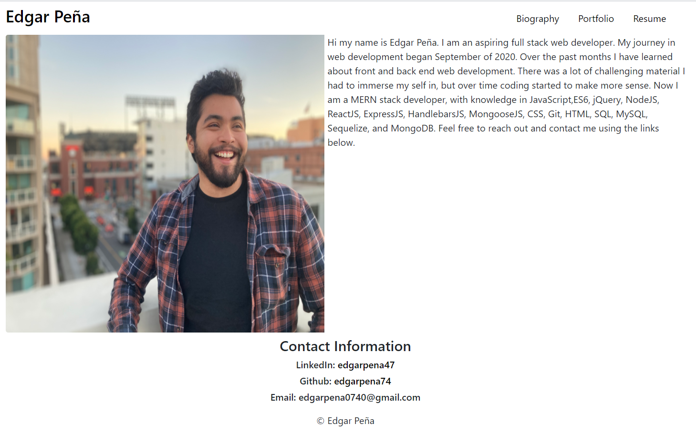

# React Portfolio

## Description

This is my portfolio made using a single page React application

<!--  -->

## Technology

HTML 5, CSS 3, React-Bootstrap, Javascript, NodeJS, ReactJS

## Deployed Application

[Portfolio](https://portfolio-edgar-47.herokuapp.com/)

## Questions

GitHub: [edgarpena74](https://github.com/edgarpena74)

Email: edgarpena0740@gmail.com

## License

None

## Contributing

Edgar Peña
